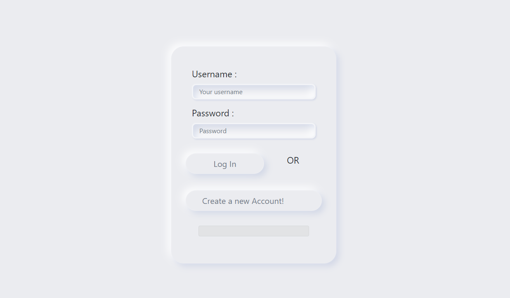
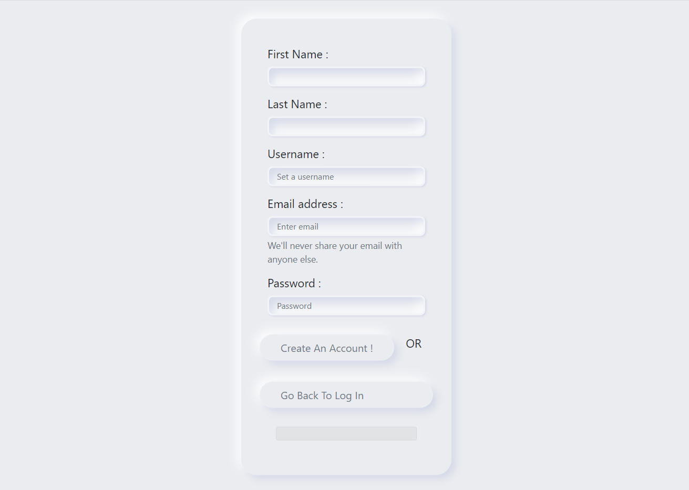
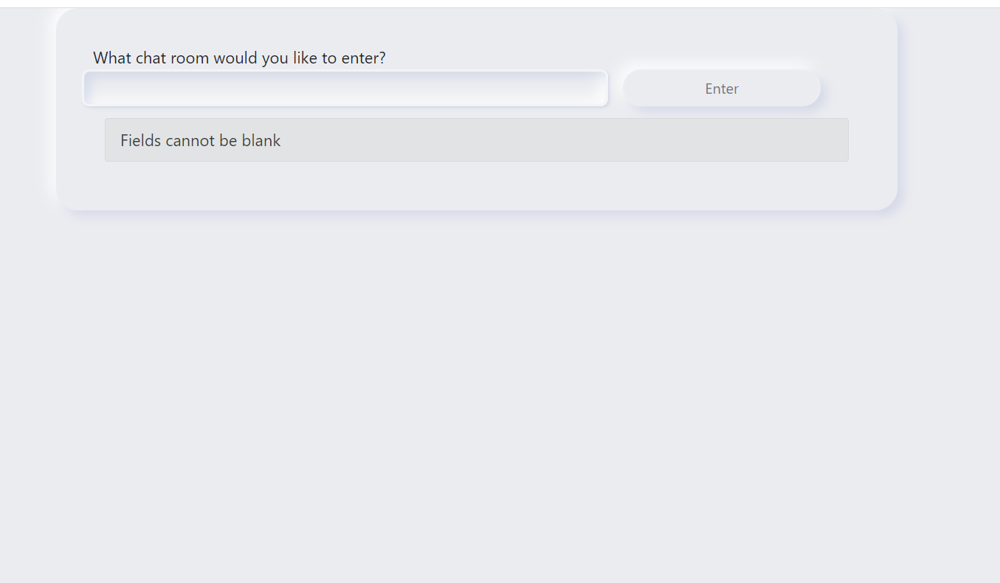
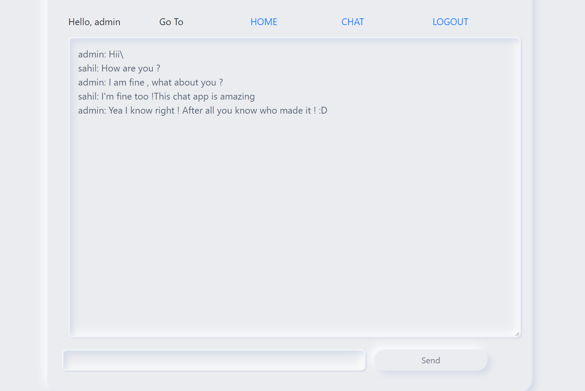

## When a user posts a message, a JavaScript function will transmit the message over WebSocket to a ChatConsumer. The ChatConsumer will receive that message and forward it to the group corresponding to the room name. Every ChatConsumer in the same group (and thus in the same room) will then receive the message from the group and forward it over WebSocket back to JavaScript, where it will be appended to the chat log.

## Following are some screenshots
### Login Page

### Register Page

### Chat Page

### Chatroom Page

link - > [click me ](https://flights-management-system.herokuapp.com/)